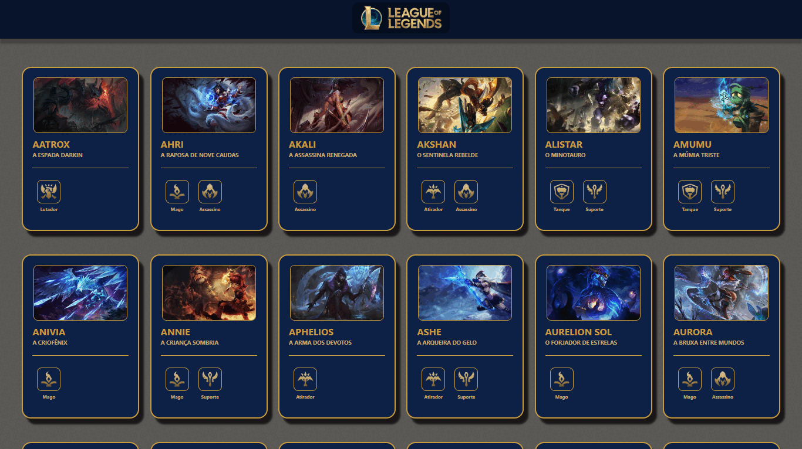

# Champions - League of Legends

Este projeto é um visualizador interativo dos campeões do League of Legends, utilizando a API oficial da Riot Games. Os campeões são apresentados em cards que foram inspirados em cartas de deck, cada um contendo informações detalhadas como nome, título, imagem, funções e históriado campeão.

A identidade visual do projeto segue uma paleta de cores baseada nas diretrizes da Riot Games, garantindo uma maior fidelidade ao jogo. O design inicial foi prototipado no Figma para refinar a experiência do usuário e a disposição dos elementos.

#

 

 

## Tecnologias utilizadas

     
     
     
      
     
      

 

## Links importantes 
- **API utilizada:**  
  [Riot Games - API](https://ddragon.leagueoflegends.com/cdn/14.19.1/data/pt_BR/champion.json)  

- **Paleta de cores oficial:**  
  [Riot Games - Colors](https://brand.riotgames.com/pt-br/league-of-legends/color/)  

- **Figma:**  
  [Protótipo](https://www.figma.com/design/DansNeGtXRN9y0x2Qj4sM5/Champions-Lol?node-id=2-179&node-type=frame&t=NmPpdFXTjuOexgia-0)  
